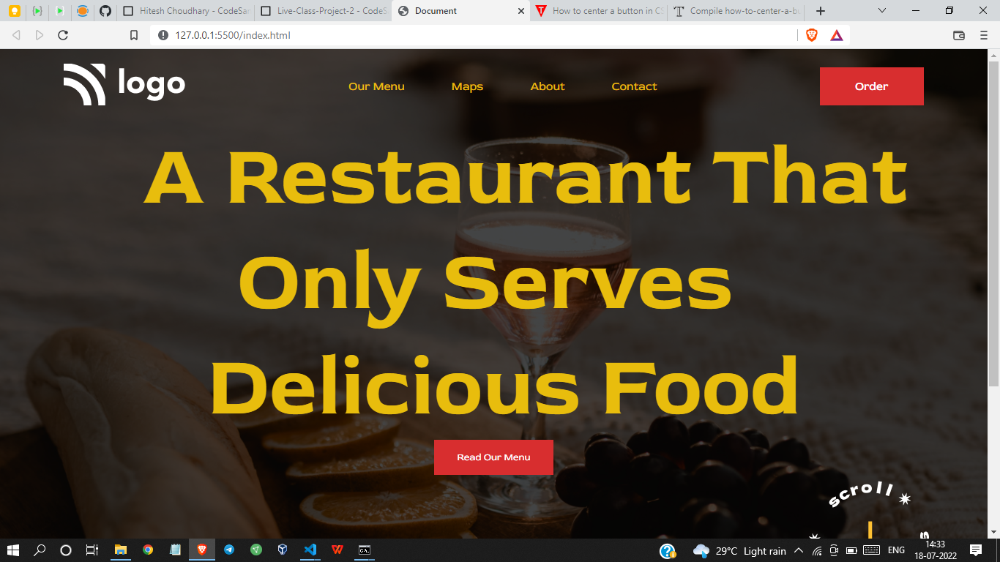

# Project 2 - HTML  and CSS 

By Shreesha

Here's the Live Deployed Website of 

## Project 02  [DEPLOYED LINK](https://project02-restraunt-page.netlify.app/)

# What did I learn in this project

- I got to learn about the positioning of images 
- Got to learn about the ways of adding gradients to the background
- got to learn how to design buttons 

## Time taken to complete project is 3 hours
